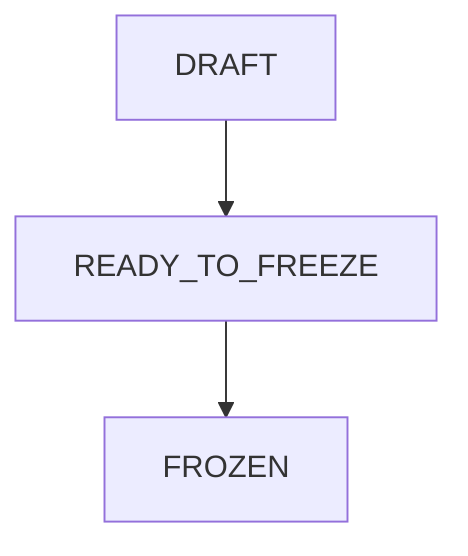

# META_04 - Règles de rédaction standard de fichiers 

Ce document sert de charte rédactionnelle et conceptuelle pour les fichiers du framework.
Un format n'existe que s'il a une utilité.

---

## 1. Format de base (par défaut) : Markdown `.md`

### 1.1 Usage
- Fichiers sources : SYSTEM / CORE / PACKAGE / PRODUCT
- Toute documentation “source of truth”

### 1.2 Pourquoi
- lisible, diffable (Git), compatible Obsidian
- indexable pour AnythingLLM

### 1.3 Règles minimalistes de structure
- 1 seul `# H1` par document
- Hiérarchie claire : `##2)` puis `###3`, `####4`...
- Blocs copiables : checklists, tableaux courts, code fences
- Éviter les séparateurs `---` en cascade (1 seul pour gros blocs si nécessaire)

---

## 2. Métadonnées : YAML frontmatter
### 2.1 Principe
Le frontmatter YAML sert de “carte d’identité” du document.  
Il doit rester **court** et **stable**.
Il permet de tracer chaque document et leurs versions dans le git.
Lorsqu'un champ ne peut être rempli - pas nécessaire : [x]. 

### 2.2 Champs

1. Obligatoires 

- `id` (unique)
- `type` (INDEX|WORKFLOW|GIT|LLM|BACKLOG|PATCH|META|FIELD|RESTRAINT|TOOLING...) -> correspond aux familles d'un arc.
- `title` (UpperCamelCase)
- `version` (vX.X)
- `status` (DRAFT|READY_TO_FREEZE|FROZEN|DEPRECATED)
- `created` (J-M-A)
- `updated` (J-M-A)
- `tags` (a,b,c)
- `depends_on` (IDs)
- arc: (SYSTEM|CORE|PACKAGE|PRODUCT|CACHE)
- `scope` : (docs, script, vault)

2. En fonction du type de fichier 

```yaml
active-package: PACKAGE_NUM_TITRE
active-product: PRODUCT_NUM_TITRE
```

### 2.3 À éviter
- Des métadonnées trop longues (elles deviennent du contenu)
- Des champs “esthétiques” (couleurs, emojis, etc.) comme dépendance système

## 3. Champ supplémentaire unique YAML 
## 3.1 Usage
- **State** pour la production PACKAGE<->PRODUCT (pointeurs : `Active`, `Unactive`) 

## 3.2 Règle
- 1 seul fichier d’état global max (sinon : incohérences).

---

## 4. JSON `.json` (données strictes)
### 4.1 Usage
- données destinées à être consommées par une future app / API
- exports propres de structures (ex. listes normalisées)

### 4.2 Pourquoi
- strict, standard, très compatible tooling

---

## 5. CSV `.csv` (tabulaire simple)
### 5.1 Usage
- budgets, inventaires, listes d’artistes/projets, timelines chiffrées

### 5.2 Pourquoi
- simple, diffable
- importable dans Excel/Sheets
- facile à valider et transformer

---

## 6. TOML `.toml` (config outillage) — optionnel
### 6.1 Usage
- config stable d’outils (quand requis par un outil)

### 6.2 Pourquoi
- lisible et moins fragile que YAML pour du paramétrage

---

## 7. Mermaid (dans `.md`) — diagrammes versionnés
### 7.1 Usage
- workflows Doc→Code
- cycles DRAFT → READY → FROZEN
- organigrammes légers

### 7.2 Exemple



---

## 8. Images / PDF
### 8.1 Types
- `.png/.jpg` : schémas, captures, UI
- `.pdf` : exports, dossiers, annexes

### 8.2 Règle
- tout document visuel “critique” doit avoir un **companion** `.md` (résumé + points d’action) pour l’indexation RAG.

## 9. Changelog

- v1.0 (28-02-2026): Définition des formats de rédaction/conception et leurs règles d'usage pour le mentor LLM - GAPC Beta v1.0

---

## Amendements (FROZEN)
- Modifications uniquement via patch ciblé + validation + version bump.

## Changelog
- v1.1 (02-03-2026) : passage en FROZEN + normalisation frontmatter.
- v1.2 (04-03-2026) : corrections frontmatter + heading.
